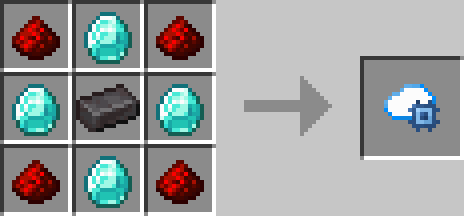
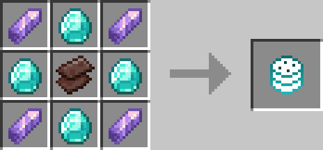

# Personal Cloud Storage

[中文](README.md)

## Introduction

Each player will have an independent cloud storage space, which can be expanded using special items. Theoretically, there is no capacity limit.

## Features

- **Automatic Replenishment**: Automatically withdraw items from the cloud storage space to ensure that the items in the inventory are always sufficient.
- **Automatic Storage When Inventory is Full**: When the inventory is full, items will be automatically stored in the cloud storage space.

## Opening Methods

- Click the personal cloud storage button in the top right corner of the inventory.
- Use the hotkey (default is 'B').

## Commands

- `/cloudstorage open [player/name/uuid]`: Opens the cloud storage space for the specified target.
- `/cloudstorage rows [player/name/uuid] [rows]`: Sets the number of rows in the cloud storage space for the specified target.
- `/cloudstorage pages [player/name/uuid] [pages]`: Sets the number of pages in the cloud storage space for the specified target.
- `/cloudstorage reload`: Reloads the configuration file.

## About Configuration

When the **Cloth Config API** is installed, right-clicking the personal cloud storage button or the personal settings switch will open the configuration screen.

## Recipes

## Preview

