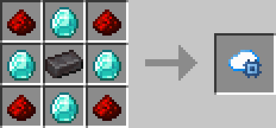
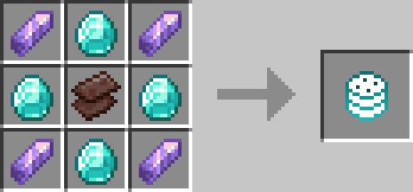
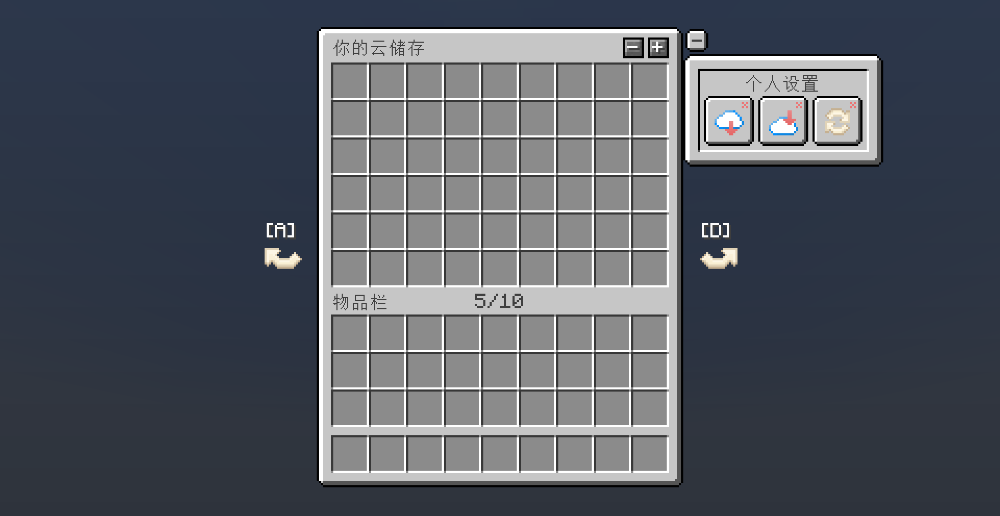

# 个人云存储

[English](README-en_us.md)

## 介绍

每个玩家都会有一个独立的云存储空间，可以使用特殊物品进行扩容，理论上无容量上限。

## 功能

- **自动补货**：可以自动从云存储空间中取出物品，保证背包中物品始终充足。
- **背包满时自动存入云储存**: 当背包满时，物品将会自动存入到云储存空间中。

## 打开方式

- 从背包中点击右上角的个人云储存按钮。
- 快捷键(默认B键)。

## 指令

- `/cloudstorage open [player/name/uuid]`：打开指定目标的云存储空间。
- `/cloudstorage rows [player/name/uuid] [rows]`：设置指定目标的云存储空间的行数。
- `/cloudstorage pages [player/name/uuid] [pages]`：设置指定目标的云存储空间的页数。
- `/cloudstorage reload`：重新加载配置文件。

## 关于配置

当安装了**Cloth Config API**时，右击个人云存储按钮或者个人设置开关可以打开配置面板。

## 合成配方

## 预览

